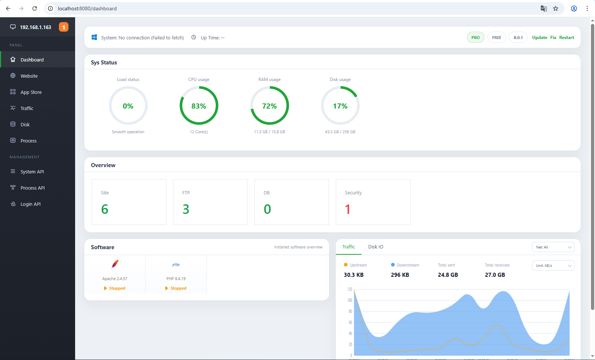

# MinPanel (Lua Edition)

MinPanel là một công cụ quản trị hosting (control panel) siêu nhẹ, di động và mạnh mẽ dành cho Windows, được xây dựng bằng Rust và hệ thống plugin linh hoạt bằng Lua.

## ✨ Tính năng chính

- **Dashboard trực quan**: Theo dõi tài nguyên hệ thống (CPU, RAM, Disk, Network) theo thời gian thực với biểu đồ sống động.
- **Quản lý Website**: Dễ dàng tạo và quản lý các trang web local, hỗ trợ SSL tự động và tùy chọn phiên bản PHP cho từng site.
- **Cửa hàng ứng dụng (App Store)**: Cài đặt và quản lý các dịch vụ máy chủ (Apache, PHP, MySQL, Redis, v.v.) thông qua hệ thống plugin Lua mạnh mẽ.
- **Giao diện Windows Native**: Tray icon nhỏ gọn giúp khởi động/tắt server nhanh chóng và truy cập link quản trị chỉ với một cú click.
- **Siêu nhẹ & Di động**: Chạy mượt mà dưới dạng ứng dụng standalone, không cần cài đặt phức tạp.

## 📸 Ảnh chụp màn hình

### Dashboard


## 🛠️ Công nghệ sử dụng

- **Backend core**: [Rust](https://www.rust-lang.org/) (Sử dụng Axum cho API và Tokio cho async runtime)
- **Giao diện quản trị**: HTML5, Vanilla CSS, JS (Thiết kế hiện đại, hỗ trợ Responsive)
- **Hệ thống Plugin**: [Lua](https://www.lua.org/) (Linh hoạt, dễ dàng mở rộng tính năng mới)
- **Native GUI**: Win32 API (Thông qua crate `windows-sys` để tối ưu dung lượng)

## 🚀 Hướng dẫn cài đặt

### Yêu cầu hệ thống
- Hệ điều hành: Windows 10 trở lên.
- [Rust Toolchain](https://rustup.rs/) (nếu bạn muốn build từ mã nguồn).

### Cách build và chạy
1. Clone repository về máy:
   ```bash
   git clone https://github.com/your-repo/MinPanel_lua.git
   cd MinPanel_lua
   ```
2. Build ứng dụng:
   ```bash
   cargo build --release
   ```
3. Sau khi build xong, file thực thi sẽ nằm tại:
   `target/release/MinPanel.exe`

## 📂 Cấu trúc dự án

- `src/`: Mã nguồn chính của ứng dụng Rust.
- `src/ui/`: Chứa các template HTML và asset cho Dashboard.
- `data/plugins/`: Nơi chứa các file script Lua điều khiển phần mềm (Apache, PHP, etc.).
- `assets/`: Chứa các tài liệu, screenshot và icon ứng dụng.

## 🤝 Đóng góp

Mọi đóng góp nhằm cải thiện MinPanel đều được chào đón. Vui lòng tạo Issue hoặc gửi Pull Request.

---
*Phát triển bởi đội ngũ MinPanel.*
